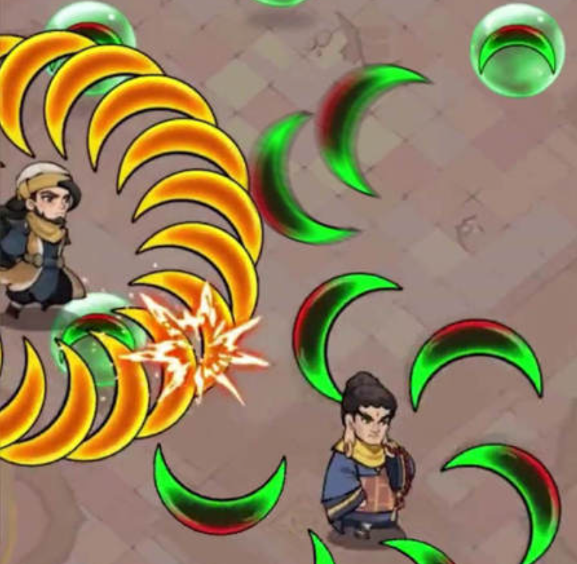
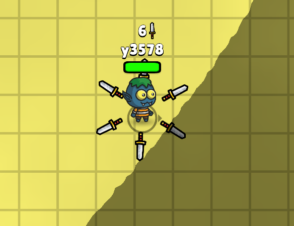
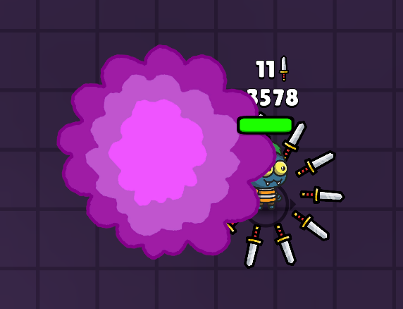
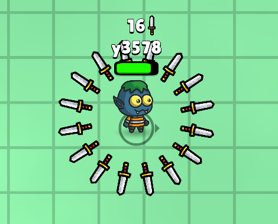
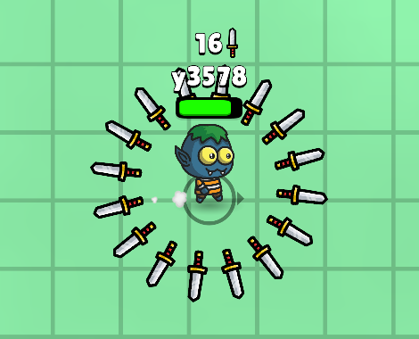
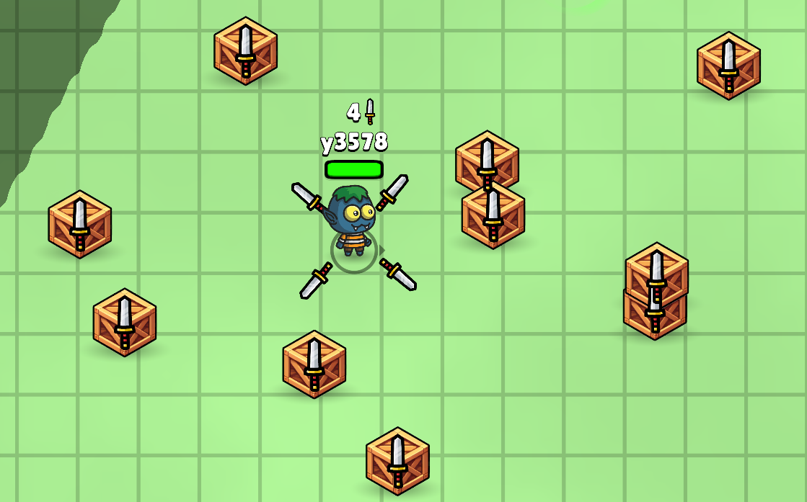
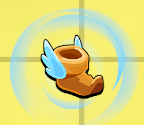
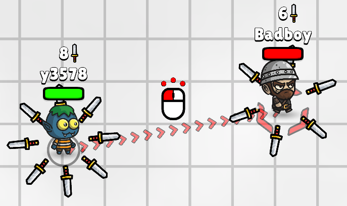
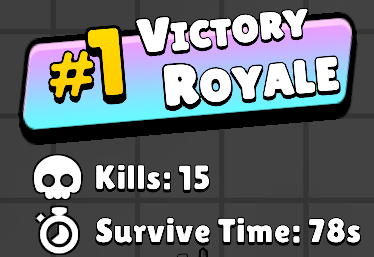
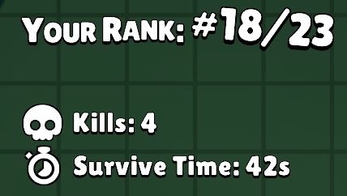

# Kniflash

## 目录

[TOC]

<div style="page-break-after: always; break-after: page;"></div>

## 必读

> [!CAUTION]
>
> <span style="font-size:1.3em;">代码原创性声明</span>
>
> 本项目要求所有代码成果必须为开发者**独立创作**。<span style="color:#FF0000; font-weight:bold;">严禁</span>通过复制往届作业、网络代码仓库或其他公开资源获取源代码。任何代码剽窃行为将依据[学术诚信](https://integrity.mit.edu/)<span style="color:#FF0000; font-weight:bold;">严肃处理</span>。
>
> <span style="font-size:1.3em;">开源项目使用准则</span>
>
> 若选择基于现有开源项目进行开发（不推荐），你需要：
>
> 1. 在[文档](#文档)中的显著位置披露所引用的开源项目信息，并在验收时主动告知责任助教。
>
> 2. 在使用开源项目的基础上仍保持**相当的工作量**。你必须报告你所有的修改与架构调整记录，直到**责任助教**认为你的工作量达到或超过自主开发的水平（这样做一方面为了维护考核公平性，另一方面是确保你使用开源项目是为了更好地完成需求，而非规避开发责任）。
>
>    注：单纯调整界面布局、修改配置参数、替换资源文件等操作，<span style="color:#FF0000;">不计入</span>有效工作量 。

> [!TIP]
>
> <span style="font-size:1.3em;">我可以使用什么库开发？</span>
>
> 任何涉及 C/C++ 的库。在手册中提供了实现图形化界面（尤其是 Qt）的一些参考资料，以及本项目基于 Qt 的初始界面代码。你的 GUI（[什么是 GUI ？](https://baike.baidu.com/item/%E5%9B%BE%E5%BD%A2%E7%94%A8%E6%88%B7%E7%95%8C%E9%9D%A2/3352324)）不必一定使用 Qt 开发，也可以是 SDL2 等第三方图形库实现的图像渲染。你甚至可以实现一个 CLI（[什么是 CLI ？](https://baike.baidu.com/item/%E5%91%BD%E4%BB%A4%E8%A1%8C%E7%95%8C%E9%9D%A2?fromModule=lemma_search-box)），比如用 ncurses 之类库实现终端窗口。界面的好坏**不算在**基础功能中。但无论如何，你必须使用 <span style="color:#FF0000;">C/C++</span> 进行开发，你的程序必须符合<span style="color:#FF0000;">面向对象</span>程序设计范式。
>
> <span style="font-size:1.3em;">写 PA2 的最佳姿势</span>
>
> 手册篇幅虽长，但无需紧张——其中大部分为引导性说明与知识讲解。在每阶段的末尾，手册会列出一个任务清单，帮你快速了解本阶段需要完成的任务。建议先浏览一遍所有的任务清单，明确各环节目标，建立全局认知（和对 PA2 代码量的认识😋）。如果你对手册的内容有疑惑，请立即联系责任助教。如果你出现代码调试问题，务必<span style="color:#FF0000; font-weight:bold;">完整阅读并充分理解</span>[如何提问](#如何提问)章节之后再询问责任助教。

<div style="page-break-after: always; break-after: page;"></div>

## 前言

类幸存者游戏（[Survivor-like Games](https://www.reddit.com/r/survivorslikes/)）是一种以生存和战斗为核心的轻度[肉鸽](https://store.steampowered.com/category/rogue_like_rogue_lite/)（Rogue-Lite）游戏。代表作品有：[Vampire Survivors - 吸血鬼幸存者](https://store.steampowered.com/app/1794680/Vampire_Survivors/)，[Brotato - 土豆兄弟](https://store.steampowered.com/app/1942280/Brotato/)，[黎明前20分钟](https://store.steampowered.com/app/1966900/20/)等。2023 年 8 月左右，此类游戏爆火，各种短视频网站上涌现出大量相似的游戏广告，它们不约而同地以“转刀”为主题。广告很吸引人，但游戏内容往往与其不符，被称为“虚假广告”。

<center>

<br>
<div style="color:orange; border-bottom: 1px solid #d9d9d9; display: inline-block; color: #999; padding: 2px;">
Figure: 广告中经常出现的画面
</div>
</center>
在 PA2 中，我们将把虚假广告变为现实，实现一个自己的“类幸存者”网红游戏。

> [!IMPORTANT]
>
> 鸣谢与说明：
>
> - 关于名称：“Knife” 代表游戏中的飞刀元素，“flash” 强调飞刀快速出击的特点。
> - 创意来源：本项目灵感源自网络，大部分图片素材取自[Knife.io](https://www.crazygames.com/game/knife-io)。若你对本手册中的描述有任何疑问，不妨亲自体验这款游戏，以加深理解。

## 分数构成(TBD)

文档（必做 10%）

代码风格（必做 5%）

阶段一（必做 35%）

阶段二（必做 30%）

阶段三（必做 10%）

阶段四（选做 10%）

<div style="page-break-after: always; break-after: page;"></div>

<center>
    <span style="font-size:2em;">欢迎来到 PA2 ！！</span>
</center>
## 文档

### Hello, PA2!

在写下第一行代码之前，你是否曾考虑过把它视为一个工程项目，想象有许多人与你共同开发？

如果你确实这样想过，那么你接下来要做的事情一定是致力于提高代码的可读性，以便其他人能够快速理解你的代码。然而，随着开发的不断推进，项目规模逐渐扩大，仅仅提高代码可读性已经不够了——其他人可能根本不知道出现问题时应定位到哪个代码文件！怎么办呢？

如果你没有这样想过，也没关系。本项目体量较大，你可能会遇到一些暂时无法解决的问题。此外，由于开发周期较长，你可能会在某一天突然想到一个绝妙的点子，但目前还无法实现它。这些问题和想法应该记录在哪里呢？

没错，这两个问题有一个共同的答案：项目文档。

当你开始构建一个超过两个文件的项目时，你就应该考虑写一个文档。文档是阐明代码的功能和目的、促进协作和简化维护的利器。写文档还有助于你真正理解所写的代码，不然你可能会出现下图的情况​🤓:

<center>
	
    <div style="color:#C0C0C0; text-decoration:underline">
		Figure: A meme
	</div>
</center>
<div style="page-break-after: always; break-after: page;"></div>

文档的种类包括：

|   类型   | 描述                                                         |
| :------: | ------------------------------------------------------------ |
| 用户文档 | 指导用户如何使用软件。                                       |
| 技术文档 | 体系结构、设计和实现的详细信息。                             |
| API 文档 | 如何使用 API 的说明，包括终端节点和示例。比如 DeepSeek 的 [API 文档](https://api-docs.deepseek.com/zh-cn/)。 |
| 内联文档 | 代码中解释特定行或块的注释。（你没看错，注释也是文档的一种！实际上，某些语言甚至为内联文档规定了专门的语法，例如 [Javadoc](https://www.baeldung.com/javadoc)，[Python Docstrings](https://www.geeksforgeeks.org/python-docstrings/)。还有根据注释自动生成文档的工具：[Doxygen](https://www.doxygen.nl/)，[rustdoc](https://doc.rust-lang.org/nightly/rustdoc/)） |

### Hello, doc!

> 致谢：文档内容的规范改编于 CS 61B proj2 [gitlet](https://sp21.datastructur.es/materials/proj/proj2/proj2)。这是 PA2 的出题助教最喜欢的 project。

1. 在本项目中，你需要为你的游戏编写一个“技术文档”，即介绍代码的体系结构、设计和实现。

2. 文档具体要求如下：

   1. 文件树

      - 文件树是文件的树形表示。下面是一个真实的项目的文件树：

        ```text
        .
        ├─archives
        │  ├─maps
        │  └─saves
        ├─build
        │  └─ ...  // 这里省略一些内容
        ├─game
        │ ...  // 这里省略一些内容
        ├─windows
        └─windows_impl
        ```
        
      - 你需要上网查找自动生成文件树的命令。
      
      - 在文件树中，需要你对每个**文件夹**做出解释。
      
        - 解释的形式不限。你可以在文件树下方将文件夹名抄一遍，在后面写上对应的解释；也可以直接在文件树后面附上注释：
      
          ```text
          .                <- 项目文件夹
          ├─archives       <- 存档和地图存放处
          │  ├─maps        <- ...
          │  └─saves
          ├─build
          │  └─ ...
          ├─game           <- 与游戏有关的头文件
          │ ...
          ├─windows        <- 与窗口有关的头文件
          └─windows_impl   <- 实现窗口逻辑的代码
          ```
          
        - 可以忽略项目自动生成的文件夹（例如 build）。如果你像这个项目一样，对代码文件进行了文件夹归类，那么你还需要解释这些文件夹的内容。
        
      
   2. 类和数据结构
   
      - 需要包含所有的<span style="color:#FF0000;">自行创建的</span>类。
      - 简短描述所有成员变量和静态变量（如果有）的用途。
      - 在本节的解释尽可能简洁。如果你发现文档太冗长，可以缩短此部分。
   
   3. 算法
   
      - 对每个类，列出方法的高级（high level）描述。也就是说，不要逐行解释代码（这是注释的任务）。
      - 列出方法所有的边界情况（corner cases）。
      - 最多用三句话描述清楚一个方法或函数的功能（除了边界情况）。

   4. 辅助函数（如果有）

      - 高级描述。
      - 说明该辅助函数用于哪些类中。


### Hello, markdown!

1. Markdown 是一种轻量级标记语言，旨在减少人们对复杂排版指令的依赖。
2. Markdown 的特点
   - 易读易写：Markdown 使用简单的标记语法，使得文档在纯文本形式下也很容易阅读（人肉编译器）。
   - 兼容性：Markdown 文档可以与 HTML 混编，并且可以导出为 HTML、PDF 等格式。
   - 广泛应用：如 GitHub、Reddit、Discord 等，都使用 Markdown 来撰写说明文件或论坛帖子。此外，几乎所有的生成式 AI 都使用 Markdown 格式进行文本输出。
3. 如果你尚未了解 Markdown 的强大之处，可以快速浏览一遍手册，这个手册就是使用 Markdown 编写的。坐和放宽（Sit back and relax），你可以比我写的更好！
4. 用 Markdown 编写文档
   1. 花费 10 分钟阅读这个[小抄 (Cheat Sheet)](https://www.markdownguide.org/cheat-sheet/)，你就可以了解几乎全部的 Markdown 语法，这些用于写文档已经足够。
   2. 你可以使用 [Obsidian(免费)](https://obsidian.md/)、[Typora(买断)](https://typora.io/)、[VSCode(免费，需要花时间配置)](https://code.visualstudio.com/Docs/languages/markdown) 来编写 Markdown 文档，或者使用一些在线的编辑器。

> [!TIP]
>
> 如果你不想因为做这个项目而学其他东西，没关系😊​。你可以打开记事本，就像编辑纯文本文件那样编写你的文档。我们仅关注文档的内容，文档格式与分数无关。

### 任务清单

你需要在**最终验收**时提交一个 `README.md` 或 `README.txt` 文档。文档格式不作要求，但必须包含以下内容：

- 文件树及各个文件夹的解释。
- 每个自建类的成员变量、静态变量、方法的解释。
- 辅助函数的解释，及其用在哪些类中。

<div style="page-break-after: always; break-after: page;"></div>

## 代码风格

### OOP \& Template \& Exception

1. 本项目作为《高级程序设计》课程的大作业，核心教学目标之一在于促进理论知识与工程实践的融合。我们首先强调面向对象程序设计（OOP）范式的使用。具体来说，你需要：
   - 至少从头创建一个基类(不继承自其他类)。
   - 至少使用一次继承。可以继承 Qt 库的类，也可以继承自己创建的类。
2. 泛型编程
   - 推荐在适宜场景中合理运用模板。
   - 本项不作强制要求。
3. 异常处理
   - 鼓励在关键代码中实现异常捕获与处理机制。
   - 评分标准为程序是否出现不可控崩溃，不强制要求使用异常处理。

> [!TIP]
>
> C++ 语言特性繁杂，但切忌陷入“为用而用”的陷阱。当你选择使用新特性时，应当始终以提升代码表达能力为核心，而非追求炫技。
>
> 以移动语义为例：使用 `std::move(XXX)` 不是为了优化性能，而是向他人传达对象资源所有权转移的语义。如果你暂时没有理解这个例子，你只需要记住：当某个特性能够更精准地表达程序设计意图时，它才成为必要之选。

### Format

除了代码内容，代码格式也十分重要。良好的代码格式不仅能提升代码的可读性，还能帮你更高效地发现潜在的错误。

在项目开发中，最佳实践是制定并严格遵守一套统一的代码格式规范。你可能会问，有没有一种广泛认可且通用的代码格式规范？

有的兄弟，有的。比如说 [Google C++ Style Guide](https://google.github.io/styleguide/cppguide.html)。

然而，当你打开上述链接并浏览几页后，可能会因为文档的篇幅感到望而却步。你可能会疑惑：真的有人会完整阅读这份文档后再开始编写代码吗？如果没有时间深入研究，如何确保代码符合这些格式规范呢？接下来我们介绍：`clang-format`！

#### 使用 clang-format 自动格式化代码

`clang-format` 是由 LLVM 项目提供的开源工具，专门用于对 C、C++、Objective-C 等语言的源代码进行格式化。它能够根据预定义的代码样式规则，自动调整源代码的布局，保证一致的代码风格。

在 Qt Creator 中使用 `clang-format` 非常简单。Qt Creator 已经内置了 `clang-format`，只需进行简单配置即可使用。

#### 配置步骤

1. 打开 Edit -> Preference，找到 C++ -> Code Style。按照下图完成相关设置。

<center>

<div style="color:orange; border-bottom: 1px solid #d9d9d9; display: inline-block; color: #999; padding: 2px;">
Figure: clang-format 的配置
</div>
</center>

2. 在项目目录中新建一个名为 `.clang-format` 的文件，并将以下内容复制到文件中：

```yaml
BasedOnStyle: Google      # 代码风格为 Google，你可以选择喜欢的风格。
AccessModifierOffset: -4  # public 等访问关键字不进行缩进。
IndentWidth: 4            # 缩进宽度为 4。你也可以选择 2 或其他数值。
```

3. 在 Custom-settings 中，点击 Import，导入刚才创建的 `.clang-format` 文件。此时，你会发现右侧的代码格式已经根据配置发生了变化。

现在，你已经拥有了一个能够自动按照规范格式化代码的工具了🎉🎉🎉！请记住，代码格式也是评分的一部分，保持良好的代码风格至关重要。


### 任务清单

- 你的代码中至少有一个自创类。
- 你的代码中至少用到一次继承。
- 时刻保持代码整洁，风格一致。

<div style="page-break-after: always; break-after: page;"></div>

## 阶段一

### 地图

#### 游戏窗口

1. 窗口的概念
   1. 游戏程序启动时，屏幕会出现一个显示游戏画面的矩形区域，我们称之为“游戏窗口”。
   2. 你的所有游戏内容都将在这个窗口（或多个并列窗口）中呈现。
2. 窗口尺寸规范
   - 游戏窗口的水平宽度必须 ≥ 1080 像素，起始界面和结束界面不作要求。
   - 垂直高度可根据实际需要自由设置，建议：
     - 利用 `resize()` 方法设置窗口大小。
     - 参考自己电脑屏幕的比例进行调整（常见比例为 16:9 或 4:3）
   - 窗口尺寸是否固定不作要求。

#### 游戏地图

1. 地图是**大小固定**的**圆形**，在边缘设有**不可穿越**的边界。边界内外要有明显的区分。

2. 由于游戏中存在多个角色，地图必须**足够大**才不至于拥挤。足够大指的是：
   - 当角色站在任意位置时，游戏窗口只能显示地图的局部区域，玩家永远无法看到完整的地图。
   - 即：地图必须比窗口大（这也是为什么在前一节规定了窗口大小）。

3. 视觉引导元素
   - 引导元素是为了帮助玩家确认运动状态。因为地图比窗口大，会出现地图全部覆盖窗口的情况。如果地图是纯色，玩家很难感受到角色的运动。

   - 引导元素可以是：同心圆环状路径、放射状道路、特殊花纹图案等。

   - 在下面这个例子中，引导元素是方格线，边界内外用明暗区分。你可以采取其他方案。

 <center>
 
 <br>
 <div style="color:orange; border-bottom: 1px solid #d9d9d9; display: inline-block; color: #999; padding: 2px;">
 Figure: 角色站在地图的边缘
 </div>
 </center>

4. 树丛

   - 初始时，地图随机生成多个树丛。在地图范围内至少有两个树丛。

   - 角色可以自由进出树丛。

   - 进入时，角色会被树叶遮挡。角色本体必须不可见，角色名、角色身边的武器、武器数量、血条是否被遮挡不作要求。

   - 在下面的示例图中，左图为部分遮挡，右图为完全遮挡。

 <center>
 
 
 <br>
 <div style="color:orange; border-bottom: 1px solid #d9d9d9; display: inline-block; color: #999; padding: 2px;">
 Figure: 角色被树丛遮挡
 </div>
 </center>

   - 如果道具生成在树丛中，则道具也会被遮挡。

 <center>
 
 
 <br>
 <div style="color:orange; border-bottom: 1px solid #d9d9d9; display: inline-block; color: #999; padding: 2px;">
 Figure: 道具被树丛遮挡
 </div>
 </center>

### 角色

#### 外观

角色可以是任何你想象的“东西”：一只小猫，一坨史莱姆，或者一个呆萌的小怪兽。

- 角色必须有站立（idle）和行走（walk）两种状态。行走时的动画应与站立有明显区别。
- 在下面这个示例中，角色行走时会带有拖尾特效，我们不要求额外的特效。

<center>


<br>
<div style="color:orange; border-bottom: 1px solid #d9d9d9; display: inline-block; color: #999; padding: 2px;">
Figure: 站立（左）和行走（右）
</div>
</center>

#### 移动

1. 逻辑上：

   - 玩家控制的角色和电脑控制的角色在地图（一个大圆形）中运动。
   - 角色之间的运动互不影响。

   > [!WARNING]
   >
   > 你或许注意到了，在示例代码中，如果一直按着 W 键（或任意移动键），角色会先往上前进一小段距离，然后停顿一段时间，再进行连续的移动。这是为什么呢？在你的游戏中，你需要修复这个问题，让角色在按下键的一瞬间就开始连续移动。如果你不修复这个问题，你将失去部分分数。

2. 视觉上：

   - 玩家无法看到地图的全貌，因此窗口的视角需要跟随角色移动。
   
   - 角色**始终位于窗口的中心**，背景相对于角色运动，从而产生角色在移动的视觉效果。
   
     
   
     
   
     
   
     
   
     > [!TIP]
     >
     > 如果只有一个角色和背景，直接移动背景就能满足要求。然而，游戏中不仅有玩家的角色，还有道具和电脑控制的角色（😨）。如果将这些元素直接放在场景中，角色（实际上是背景）移动时，电脑角色的移动会与背景的移动叠加，导致视觉效果混乱。请在示例代码中寻找解决方案。你也可以使用其他方案，只要看上去符合正常世界的物理逻辑即可。

#### 拾起道具

当角色移动到距离道具一定范围内时，视为角色拾取了道具。更多关于道具的信息，请参阅 [道具](#道具) 章节。

#### 攻击

1. 飞刀简介

   - 飞刀在游戏中用于攻击和防御。
   - 当角色获得飞刀时，飞刀会环绕在角色周围。
   - 初始时，角色有四把飞刀。
   - 角色获得飞刀的方式有两种：自动获取和拾取道具。当角色的飞刀数量 < 4 时，角色每隔 1 秒自动获得一个飞刀。当飞刀数量 ≥ 4 时，只能通过拾取道具获得飞刀。
   - 你可以不实现飞刀环绕角色的动画，但必须体现出“飞刀越多，攻击范围越大”的特点。
   
<center>


<br>
<div style="color:orange; border-bottom: 1px solid #d9d9d9; display: inline-block; color: #999; padding: 2px;">
Figure: 4 飞刀（左）和 40 飞刀（右）
</div>
</center>
   - 你可以选择是否设置飞刀数量的上限。如果设置了上限，达到上限后角色将无法再拾取飞刀道具。

2. 在阶段一，由于不存在其他角色，你无需考虑攻击的实现。如果你想了解该内容，请阅读[战斗系统](#战斗系统)章节。


> [!TIP]
>
> 在阶段一，暂时没有其他角色，正常来说飞刀个数无法减少。但是，你可以设置一块特殊区域，进入这块区域自动增加/减少飞刀个数，从而方便调试。这种方法也可以用于在阶段一调试血条和死亡动画。

#### 死亡

死亡处理

- 玩家控制的角色死亡 ​💀​ 后，会在死亡地点播放一小段死亡动画，并展示游戏结束画面。
- 在阶段一，你无需关心游戏结束画面的实现。你可以选择退回到游戏开始界面，或者直接 `return 0` 退出游戏。但无论如何，游戏<span style="color:#FF0000; font-weight:bold;">不能崩溃</span>（返回值非 0）！！！

> [!CAUTION]
>
> 即使你有某些功能尚未完成，也请尽量减少游戏崩溃的可能性。验收时，游戏崩溃一次会扣很多分数。有时完成一个不完备的功能可能不如用相同时间调试代码的性价比高，请根据实际情况自主权衡。

### 道具

#### 性质

1. 道具是出现在地图上的实体。
2. 道具分为飞刀和特殊道具。
3. 初始时地图上生成一定数量的道具。
4. 道具在地图上一旦生成，其相对于地图的位置不会改变。
5. 道具被角色触碰（小于一定距离）视为被拾取，道具被拾取后消失。
6. 道具随着游戏进行会在地图上随机生成。特殊道具的数量显著少于飞刀的数量。

#### 飞刀

1. 飞刀是地图上最普通的一种道具，几乎处处可见。

<center>

<br>
<div style="color:orange; border-bottom: 1px solid #d9d9d9; display: inline-block; color: #999; padding: 2px;">
Figure: 飞刀道具
</div>
</center>

2. 角色拾起的效果为：增加一把飞刀。

#### 特殊道具

1. 你需要实现两个特殊道具。实现除此之外的道具算在扩展分数中。

   - 一些特殊道具有时间限制。持续时间不能叠加，只能重置。
   - 在持续时间内，可以直观看到角色拥有的道具，比如使用状态栏、人物特效等。不要求倒计时效果。
   - 示例图片仅供参考，你可以自行寻找喜欢的素材。
2. 道具列表

   1. 疾步之靴。效果为：增加角色的移动速度。持续 5 秒。
      - 拾取该道具后，应显示速度提升状态（如角色周围出现加速特效，或状态栏出现特殊图标），并在效果结束时移除状态标识。
   
<center>


<br>
<div style="color:orange; border-bottom: 1px solid #d9d9d9; display: inline-block; color: #999; padding: 2px;">
Figure: fleet(左), fleet status(右)
</div>
</center>


   2. 治愈之心。效果为：立即增加角色的血量（不会超过生命上限）。

  <center>
  
  <br>
  <div style="color:orange; border-bottom: 1px solid #d9d9d9; display: inline-block; color: #999; padding: 2px;">
  Figure: heart
  </div>
  </center>

### GUI

- GUI 游戏的图形界面。
- 你的 GUI 只要能展现你的游戏内容就可以了。我们希望你能集中更多精力在游戏的逻辑实现上。GUI 做得是否精美不会影响你的分数。
- 阶段一的 GUI 需要展示你的地图，角色和道具。

### 任务清单

1. 符合大小要求的窗口。
2. 实现地图。地图的性质：圆形，大小固定，足够大，不可穿越的边界，引导元素，树丛（数量 ≥ 2）。
3. 实现角色（部分）和飞刀。角色：站立和行走动画，移动，拾取道具，血条，死亡动画；飞刀：初始 4 个，环绕角色，增加和减少，攻击范围，伤害值。
4. 实现简单的游戏结束逻辑。
5. 实现道具。道具：随机生成，拾取消失，特殊道具，状态展示。
6. 实现 GUI：只要能展现游戏内容即可。

<div style="page-break-after: always; break-after: page;"></div>

## 阶段二

### 战斗系统

#### 索敌

1. “索敌”用于决定投掷飞刀的目标单位。

2. 玩家的索敌范围是有限的圆形（建议不要超过窗口大小）。

3. 范围内存在多个目标时，选择（欧氏距离）最近的单位。

4. 用特效标注被玩家锁定的敌人，特效在场景中要清晰可辨。例如：

<center>

<br>
<div style="color:orange; border-bottom: 1px solid #d9d9d9; display: inline-block; color: #999; padding: 2px;">
Figure: 索敌特效
</div>
</center>

   在这个例子中，游戏用箭头排成的直线和敌人脚下的图标来表示玩家锁定的敌人。你可以使用自己喜欢的方式进行标注，

#### 攻击

游戏中的攻击方式有两种：远程攻击和近身攻击。

1. 远程攻击

   - 触发条件：

     - 索敌成功。
     - 持有 ≥ 1 把飞刀。

   - 行为逻辑：

     ```mermaid
     graph LR
     A[投掷飞刀] -->|追踪| B{命中判定}
     B -->|成功| C[飞刀消失]
     C --> D{目标状态}
     D -->|持有飞刀| E[飞刀数-1]
     D -->|无飞刀| F[生命值扣除]
     B -->|未命中| G[飞刀消失]
     ```

   - 要求：

     - 不限制每秒远程攻击的次数。
     - 飞刀会自动追踪敌人。
     - 远程攻击也有抵消机制。
     - 当敌人血量归零时，敌人死亡，播放死亡特效。
     - 我们只要求能看到飞刀被扔出，和击中敌人后消失即可。不要求爆炸、拖尾等其他特效。

<center>

<br>
<div style="color:orange; border-bottom: 1px solid #d9d9d9; display: inline-block; color: #999; padding: 2px;">
Figure: 扔出飞刀的图解
</div>
</center>

2. 近身攻击。

   - 抵消机制
     - 当攻击方和被攻击方均有剩余飞刀时，双方飞刀相互抵销。
     - 上限：5 把 / 秒。
   - 伤害判定
     - 攻击方和被攻击方的距离 ≤ 有效攻击距离。
     - 攻击方至少有一把飞刀。
     - 被攻击方没有飞刀。
     - 攻击方造成伤害后，飞刀消失。
     - 上限：5 把 / 秒。

<center>


<br>
<div style="color:orange; border-bottom: 1px solid #d9d9d9; display: inline-block; color: #999; padding: 2px;">
Figure: 远距离(左), 近距离(右)
</div>
</center>


### 人机

1. 电脑控制的角色行为与玩家控制的角色行为完全相同
   - 复习一下，玩家角色可以：当飞刀数目 < 4 时自动获取飞刀，拾起飞刀道具和特殊道具，扔出飞刀。
2. 移动：
   - 人机会在地图上随机移动，不会停止移动，不会主动获取道具。
3. 战斗：
   - 人机锁定任何单位（包括玩家和其他人机）一秒后，每隔一秒钟向该角色扔出一把飞刀。
   - 人机锁定角色没有任何特效。
   - 人机不会主动近身攻击任何角色。
4. 规定：
   - 初始地图上至少有 <span style="color:#FF0000;">5</span> 名人机，位置随机。

> [!TIP]
>
> 实现人机较为复杂，直接复制粘贴玩家角色的代码并不可靠（建议使用继承，你需要考虑父类是什么）。可以将任务分解为以下步骤：
>
> 1. 实现静态实体：创建一个不会移动、能够受到伤害的实体，并进行调试。
> 2. 实现移动实体：创建一个随机移动的无敌实体，并进行调试。
> 3. 组合与调试：将上述两个实体的代码整合，并进行最终调试。

### 游戏结束画面

1. 游戏终止条件：

   - 胜利条件：玩家存活且其他单位全灭。
   - 失败条件：玩家生命值 ≤ 0。

2. 计分板：游戏结束时，显示本局玩家消灭单位数量（Kills）和存活时间（Survive Time）。

3. 游戏胜利时，显示 "Victory" 等字样。

<center>

<br>
<div style="color:orange; border-bottom: 1px solid #d9d9d9; display: inline-block; color: #999; padding: 2px;">
Figure: 游戏胜利画面
</div>
</center>

4. 游戏失败时，显示玩家排名，以“排名/总人数”的格式表示。例如，游戏开始共有 23 人（算上玩家），玩家死亡时场上存活 17 人，那么玩家排名为：18/23。

<center>

<br>
<div style="color:orange; border-bottom: 1px solid #d9d9d9; display: inline-block; color: #999; padding: 2px;">
Figure: 玩家排名与计分板
</div>
</center>

### 任务清单

1. 实现玩家角色的近身攻击，远程攻击。
2. 实现人机角色的移动，远程攻击。
3. 实现计分板和排名计算。
4. 实现游戏结束画面。

<div style="page-break-after: always; break-after: page;"></div>

## 阶段三

### GUI

此时，你应该已经实现了较为完善的游戏内逻辑。如果你能够将前两个阶段 80% 的内容成功展现在屏幕上，那么你的 GUI 技术已经达到了中等偏上的水平。在阶段三的 GUI 部分，你需要在完善前两阶段 GUI 的基础上，进一步提升玩家的游戏体验，让他们感受到这是一个完整且流畅的游戏。具体来说，你需要完成以下任务：

1. 游戏的开始界面。界面上必须至少包含“开始游戏”和“退出游戏”两个按钮。
2. 游戏结束后，除了显示计分板和结束画面外，还需添加一个“返回”按钮，用于返回开始界面。
   - 从这一阶段开始，除非玩家主动点击退出，否则游戏在正常情况下不会退出。

> [!TIP]
>
> 如果阶段二的结束画面和游戏画面涉及多窗口，那么阶段三将涉及多窗口切换的问题。
>
> 你可以思考一下，窗口之间的切换具有一定的逻辑性。例如，开始界面的窗口只能切换到游戏界面，而不能直接切换到游戏结束界面。但如果需求是随机访问三个窗口，该如何处理呢？
>
> 一种简单的解决方法是为每个界面创建一个独立的窗口，并在需要切换时调用相应界面的 `hide` 和 `show` 方法。这种方法的优点是实现简单，但可能会导致游戏体验的割裂感。回想一下你玩过的游戏或使用的应用程序，它们的操作大多是在一个窗口内完成的。这是如何实现的呢？
>
> 假设我们有很多窗口。当我们切换到某个窗口时，只能对这个窗口进行操作。这类似于将窗口看作书，初始时所有书叠放在一起。当你需要查看哪本书时，只需将其拿到最上面。这体现了窗口（书本）的堆叠（stack）关系。恰好，Qt 为我们提供了一个名为 [QStackedWidget](https://doc.qt.io/qt-6/qstackedwidget.html) 的组件，你可以查看文档，并尝试利用它管理界面。

### 单位受击效果（5%）

1. 在阶段二中，我们已经实现了游戏的战斗系统。然而，如果角色被攻击时没有任何反馈，单位的血量悄无声息地减少，这会严重影响玩家的游戏体验。因此，在阶段三中，我们需要在游戏界面中展示单位的受伤效果。
2. 你可以自行决定飞刀的伤害值，但不能设置为一击必杀（除非有特殊道具），否则受击效果将失去意义。
3. 提示：
   - 不必播放复杂的动画，可以简单地让单位的图形闪烁一下。
   - 或者在单位头上绘制血条，显示当前血量。
   - 还可以在单位头上显示一个的数字，表示受到的伤害值。
   - 总之，只要能让玩家感受到反馈即可。

### 任务清单

1. 实现开始界面，包括“开始游戏”和“退出游戏”两个按钮。
2. 实现结束界面的“返回”按钮。
3. 实现单位受击效果。

<div style="page-break-after: always; break-after: page;"></div>

## 阶段四

> [!TIP]
>
> 在未充分测试前三个阶段代码的情况下，不建议尝试完成阶段四。否则，因游戏崩溃而扣掉的分数可能会超过你在阶段四中获得的分数。

1. 阶段四为扩展阶段，占项目总分的 10%，评分依据工作量而定。
2. 你可以选择完成一个大型功能以直接获得 10 分，或者完成多个小型功能。不同功能的分数累积计算，总分上限为 10 分。
3. 以下内容仅为建议，我们欢迎任何新的创意。

### 扩展功能列表

1. 视听派对（10 分）
   - 为游戏添加音效。
   - 友情提醒：若想在此项获得满分，需添加背景音乐、攻击音效、飞刀抵消音效、飞刀击中单位音效、死亡音效、按键音效、拾取道具音效、游戏结束音效等全部音效，否则只能获得部分分数。
2. AI 入侵（10 分）
   - 人机变得更加智能，可以拾取特殊道具，并且会主动进攻和逃跑。
3. 真正的 PVE（10 分）
   - 模仿《吸血鬼幸存者》的 PVE 玩法，即打怪升级 \+ BOSS 战。（可能需要考虑存档功能）
4. 吃鸡模式（5 分）
   - 地图变得更大，并且会随着游戏进行，每隔一段时间逐渐缩小。
5. 牛顿的苹果（10 分）
   - 为游戏添加物理模拟。
   - 你需要重写战斗系统。当角色扔出飞刀时，飞刀不再自动追踪目标，而是沿出手方向飞行，碰到边界后消失。
   - 远程攻击时，若飞刀在视觉上穿过单位周围飞刀的缝隙并击中敌人，则实际判定为击中，即使敌人周围仍有飞刀。
   - 近战攻击时，若被攻击者的飞刀在视觉上未与攻击者的飞刀重合，则这些飞刀不进行抵消。
6. 天灾（5 分）
   - 游戏进行一段时间后，触发 30 秒的天降陨石事件。陨石会在玩家脚下生成，并在造成伤害前提供 1 秒钟的预警。
7. 敌人显示（10 分）
   - 在窗口边界以小头像形式显示敌人的方向。
8. 设计并实现新的道具，丰富游戏玩法。
9. 自由创意，实现任何你认为有趣的功能。

### 任务清单

- 实现若干功能，确保总分 ≥ 10。

<div style="page-break-after: always; break-after: page;"></div>

## 杂项

### 如何提问？

#### 学会提问

作为刚接触计算机世界的同学，理解如何有效地提问和解决问题是至关重要的。我们强烈建议你仔细阅读[提问的智慧](https://github.com/ryanhanwu/How-To-Ask-Questions-The-Smart-Way/blob/master/README-zh_CN.md)和[别像弱智一样提问](https://github.com/tangx/Stop-Ask-Questions-The-Stupid-Ways/blob/master/README.md)。

让大家阅读这些文档，并不是为了故意浪费大家的时间，也不是为了禁止大家提出任何问题，而是为了让大家知道“什么是正确的”。当你愿意为这些“正确的做法”去努力，并且尝试用专业的方式提出问题的时候，你就已经迈出了成为“成为专业人士”的第一步。

以 Qt 开发的一个经典问题为例：假设你兴致勃勃地开始写代码，结果刚编译就遇到报错："undefined reference to \`vtable for MyClass'"。这时，你可能会想起高程课上老师讲过的虚表，但更大的可能是满脸问号，因为你平时写作业并没有遇见这样的错误。更让人抓狂的是，这个错误并不像语法错误那样容易定位和修复──它与整个类有关，这实在是太宽泛了。

这时，请按捺住你向他人求助的冲动，因为你甚至还没尝试解决这个问题！但是，你仍然不理解这个错误信息的含义，于是你把它复制到网上，试图找到答案。实际上，这个问题非常常见，网上的解释和解决方案已经相当完善。但在开发过程中，许多棘手的问题并不能在网上找到现成的答案。在这个例子中，我们假设你没有找到类似的问题。或者，你在某个论坛上发现了一个几年前的帖子，发帖人是一个和你遇到同样问题的倒霉蛋，但这个帖子下面没有任何解答——你一无所获。

这时，请再次按捺住你向他人求助的冲动，因为你还没尝试自己解决问题！代码有问题，当然要从代码中寻找答案。然而，你仍然不知道该如何应对这个错误。突然，你灵光一现（别问是怎么“灵光一现”的），空类肯定不会报错。既然 `MyClass` 报错了，那么只需要将类中的代码一行行注释掉，当到达某个临界点，编译器突然不报错了，这时注释掉的代码就是问题的关键。于是你开始执行这个想法。最后，你发现元凶是一个看起来人畜无害的 `Q_OBJECT` 宏。

这个例子里，你的代码直接触发了编译报错，这反而是一种幸运──因为你直接意识到了代码有问题。如果你试过了你想到的所有办法，还是无法解决问题，怎么办呢？

这时，你就可以考虑求助他人了。因为你已经掌握了以下信息：1️⃣问题经过充分的搜索，证明你不是随便提问；2️⃣你排除了一些无效方法；3️⃣你通过努力缩小了问题的范围。具备了这些特点，你就已经脱离了“伸手党”范畴，不仅显得更专业，也能让大佬们更愿意伸出援手。

这个案例也引发了你的一些思考。你发现，原本在你眼中无所不能的编译器，原来也会“胡言乱语”。在未来的开发中，你会逐渐意识到，遇到编译器报错一定是你的代码有问题，但问题是否与编译器报的错一致，那就听天由命了（尤其是 C++）。你可能不会立刻想起这个经典的 Qt 例子，但调试它带给你的经验会一直伴随着你。

作为总结，我们给你提供一些简单的自查手段，你至少需要把他们全部尝试一遍之后再准备提问：

1. 检查编译器报错，尤其是那些核心的报错。你要学会识别哪些报错是有用的，哪些报错是由于另一个报错引起的。比如 "error: ld returned 1 exit status" 就是一个没有实际意义的报错。
   - 当错误出现在函数调用处时，请仔细检查实参和形参的类型是否匹配，避免指针误用。特别是在 Qt 中，如果将某个类的指针错误地作为另一个类的指针传递给函数，编译器可能会在函数调用处报出一个看似不相关的错误。
2. 注释定位法：就像例子中的那样，逐段注释代码，定位问题区间。
3. STFW(Search The Friendly Website)：将报错信息粘贴至 Google/Bing 等网站搜索。
4. 向 AI 老师请教：比如 [DeepSeek 老师](https://chat.deepseek.com/)、[Qwen 老师](https://chat.qwen.ai/) 和 [ChatGPT 老师](https://chatgpt.com/)。
5. 小黄鸭调试法：传说中，程序大师会随身携带一只小黄鸭。在调试代码的时候会把小黄鸭放在桌上，然后详细地向鸭子解释每行代码。

如果你遇到拼尽全力无法战胜的问题，我们建议参考下面这个“黄金提问模板”来提问，以便你得到想要的答案：

1. 完整的错误信息截图（不要拍屏）。
2. 可复现问题的最小代码段（Minimal Reproducible Example, MRE）。[这里](https://stackoverflow.com/help/minimal-reproducible-example)有一篇文章手把手教你如何创建一个 MRE。
3. 已尝试的解决步骤。
4. 对问题的初步分析（哪怕不正确）。

#### 学会不提问

很多同学不多不少都会抱有这样的观点：“我向大佬请教，大佬告诉我答案，我就学到知识了。”

但你是否想过，将来你进入公司，你的领导让你尝试一个技术方案；或者是将来你进入学校的课题组，你的导师让你探索一个新课题。你可能会觉得：到时候身边肯定有厉害的同事，或者有师兄师姐来带我。但实际情况是，同事也要完成他的 KPI，师兄师姐也要做他们自己的课题，没有人愿意被你一天到晚追着询问，总有一天没有大佬告诉你答案，你将要如何完成任务？

如果你觉得自己搞不定，你很可能缺少独立解决问题的能力。

但幸运的是，这种能力是可以训练出来的。你身边的大佬之所以成为了大佬，是因为他们比你更早地锻炼出独立解决问题的能力：当你还在向他们请教一个很傻的问题的时候，他们早就解决过无数个奇葩问题了。事实上，你的能力是跟你独立解决问题的投入成正比的，大佬告诉你答案，展示的是大佬的能力，并不是你的能力。所以，要锻炼出独立解决问题的能力，更重要的是端正自己的心态：你来选课学习，你就应该尽自己最大努力独立解决遇到的所有问题（当然一些手册本身的问题除外）。

我想，我们的目标是一致的：希望你将来能成为可以独当一面的专业人士。但同时你也需要认识到，学习是一个长期接受专业训练的过程。如果我们仅仅把问题的答案告诉你，你就可以成为专业人士，那该如何对得起长年累月奋斗在一线的广大资深工程师们流下的汗水？

我们真心希望帮助你，所以有时给你的回复是关于你询问问题的解决方法，而不是直接给出问题的答案。你也要和我们相互配合，针对问题提出自己的思考。该查资料/看手册/看代码，就去查资料/看手册/看代码，然后尝试并总结解决方案。这对你来说并不容易，但学习本身就是一件需要付出的事情: 如果你很方便地获得了问题的答案，那你就不能从解决这个问题的过程中收获应有的训练。

### 在 Windows 11 中使用 Qt Creator

> [!NOTE]
>
> Qt 是一个应用程序开发框架，Qt Creator 则是其提供的一个 IDE。你可以使用其他 IDE（例如 Visual Studio）编写 Qt 程序，此指南仅供参考。

#### 安装

本项目的示例代码使用 Qt Community Edition ([Open Source Development](https://www.qt.io/download-open-source)) 开发。

为了免费使用 Qt，你首先需要在[此页面](https://www.qt.io/download-qt-installer-oss)下载 Qt 的安装工具。

打开安装工具后，你可能需要一个 Qt 账号。推荐你在[Qt Account Login](https://login.qt.io/login)界面进行注册后，返回安装界面登录，这样你就可以借助你的浏览器帮你保存账号密码。

其余步骤请自行上网搜索。注意，Qt 安装路径和 Qt 项目路径均<span style="color:#FF0000;">不能包含中文字符</span>！

> [!TIP]
>
> 在你安装完 Qt Creator 之后，紧随其后的问题是：找不到构建套件（Kit）怎么办？这时候你应该意识到要上网查找相关资料了。作为提醒，我们使用的版本是 Qt6，网上的很多 Qt5 教程已经 deprecated 了，在查找时请注意区分。

#### 添加模块

在使用 Qt Creator 时，你可能会发现你需要的某些库没有安装。如果你自行安装 Qt Creator 而没有参考教程，你甚至可能发现自己连 Qt 库都没安装。这时你无需重装 Qt，只需打开 Qt Maintenance Tool。除了在 Windows 中搜索，你也可以在 Qt Creator 的主界面分别点击 Tool -> Qt Maintenance Tool -> Start Maintenance Tool 来打开。

<center>

<br>
<div style="color:orange; border-bottom: 1px solid #d9d9d9; display: inline-block; color: #999; padding: 2px;">
Figure: Qt Maintenance Tool 打开方式
</div>
</center>


在这里，你可以下载或更新库。如果你无法编译运行示例代码，可以参考下面的列表对你的库进行补全：

TODO（这里在我写完示例代码后补上🫠）

> [!TIP]
>
> 如果在下载库时频繁出现网络问题需要 Retry，那么你需要看看[这篇文章](https://blog.csdn.net/qq_62888264/article/details/132645054)。你可以想想，Maintenance Tool 是否可以通过同样的方法来解决问题呢？

#### Qt 基础教程

Qt 是一款广受欢迎的 C++ 图形应用程序开发框架，以其强大的功能和丰富的特性著称。网络上关于 Qt 的学习资源非常丰富，这里推荐两份优质的教程：

1. [Qt 编程指南](https://qtguide.ustclug.org)：该教程结合 Qt Creator，从底层原理入手，深入浅出地讲解 Qt 的各个方面，适合希望系统学习的开发者。
2. [Qt 快速入门](https://wizardforcel.gitbooks.io/qt-beginning/content)：该教程从实际应用开发的角度出发，帮助开发者快速上手 Qt 开发。

此外，Qt 的[官方文档](https://doc.qt.io)是最权威且更新最及时的参考资料，尽管其内容可能对初学者来说稍显晦涩。

在 GUI 开发领域，动手实践远比阅读文档更为重要。时代变了，现在借助 AI 工具，你可以快速生成示例代码并进行测试。例如，PA2 出题助教在写 Qt 时，采用了两个项目并行的方法：一个项目用于测试各种库的表现（通过 AI 生成代码并验证结果），另一个项目则用于实际开发，将测试中表现最佳的代码整合到游戏中。

### 其他图形库推荐

在 AI 时代，你可以直接询问 AI 来获取适合初学者的 C++ 图形库推荐，并根据需求进一步了解各个库的特点。不过，按照传统，以下是一些除 Qt 之外的图形库推荐，供你参考：

1. **[FLTK](https://www.fltk.org)**：一个轻量级的 C++ 图形库，适合资源有限的项目。
2. **[wxWidgets](https://www.wxwidgets.org)**：一个相对轻量级的 C++ 图形库，提供了跨平台的支持。
3. **[SDL2](https://www.libsdl.org)**：一个流行的基于 C 的轻量级图形渲染库，提供了基础的绘图功能（如屏幕刷新、图像渲染等）。虽然功能较为基础，但易于学习。你可以参考这份 [SDL2 教程](https://lazyfoo.net/tutorials/SDL) 来快速入门。

这些库各有特点，选择适合你项目需求的库将有助于提高开发效率。

<div style="page-break-before: always; display: flex; justify-content: center; align-items: center; height: 100vh;">
    
</div>
