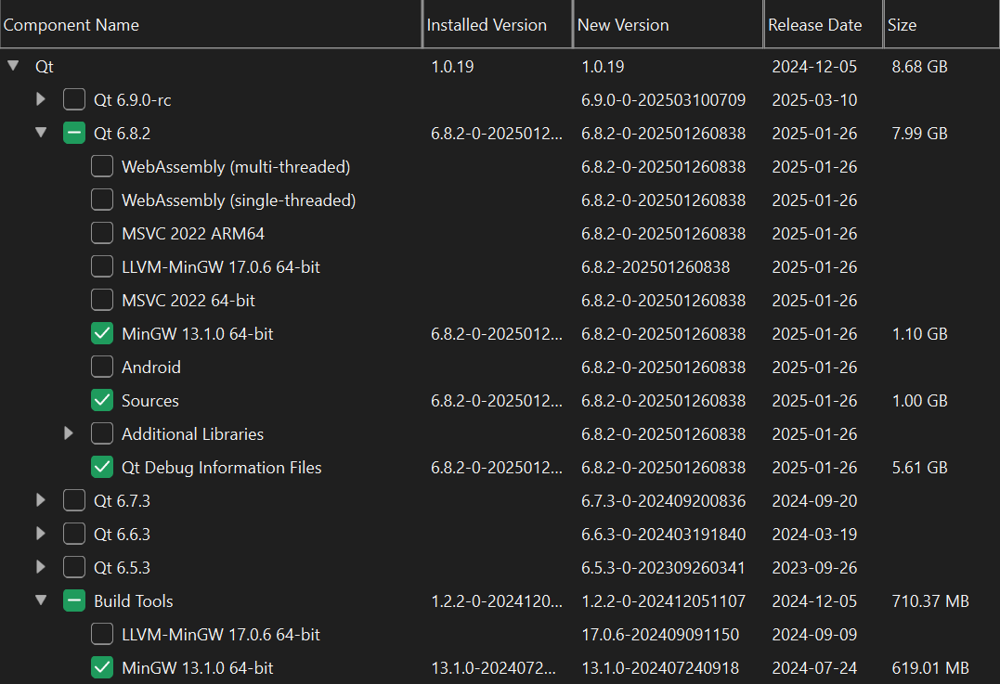

# PA2 示例代码帮助文档

## 目录

[TOC]

## 前言

欢迎来到 PA2 的示例代码部分！这份示例代码旨在为你提供一个清晰的起点，帮助你快速上手 Qt 库和 Qt Creator 的使用。无论是示例代码还是配套文档，我们都致力于为你的开发之旅铺平道路，助你以更轻松、更顺畅的方式开启项目。

## 编译与运行

在拿到示例代码后，你应当做的第一件事是编译并运行代码，而不是直接阅读代码。尤其是对于像 Qt 这样的 GUI 库来说，这一点尤为重要——只有当你亲眼看到代码的运行效果，并确认这些代码确实能够完成某些任务时，你才会更有动力去学习。此外，通过运行代码，你可以检查你的开发环境是否配置正确。

> [!IMPORTANT]
>
> 框架代码使用 Qt Creator 15.0.1 (Community) 开发，Qt 版本为 6.8.2 (MinGW 13.1.0 64-bit)。

你需要点击 Qt Creator 左下角的绿色小三角 ${\color{green} \triangleright}$ 编译并运行代码。点击后，请留意右下角的进度条。如果未出现红色错误进度条，并且弹出了一个窗口，那么恭喜你🎉！你的开发环境配置正确，可以直接跳过本节内容，无需继续查看以下部分。

---

如果编译失败，请先检查项目目录路径是否包含中文字符，Qt 项目不支持带有中文的目录。接着，请参考附录 1 的[添加模块](#添加模块)章节，对照下图中列出来的库，进行补全（框架代码中使用的库大多是 Qt 自带的，因此一般来说编译失败不是库的问题）。

<center>

<br>
<div style="color:orange; border-bottom: 1px solid #d9d9d9; display: inline-block; color: #999; padding: 2px;">
Figure: 需要的 Qt 库（不一定是最小的）
</div>
</center>

如果你按照上述步骤操作后仍然无法成功编译，请仔细查看报错信息，并尝试自行解决问题。作为新手保护，我们允许你在简单尝试后就向助教寻求帮助，无需在此问题上花费过多时间。

## 代码架构

示例代码的项目结构比较简单，如下：

```text
./example/
├── build                  <-- 项目构建文件夹，自动生成，可忽略
│   └── ...
├── example.pro            <-- Qt 项目的核心配置文件
├── figs                   <-- 在示例代码中用到的图形资源
│   ├── background.jpg
│   └── capoo.gif
├── main.cpp               <-- 入口代码
├── mainwindow.cpp         <-- 主窗口代码
├── mainwindow.h           <-- 主窗口头文件
├── mainwindow.ui          <-- 主窗口 UI 文件
├── mygraphicsview.cpp     <-- 一个基于 QGraphicsView 的自定义类
├── mygraphicsview.h       <-- 这个类用于绘制游戏窗口
├── README.md              <-- 帮助文档源文件
├── README.pdf             <-- 帮助文档
└── src.qrc                <-- 一个 XML 文件
                               定义了资源的路径和组织结构
                              （你可以尝试用文本编辑器打开它）
```

## 如何XXX

### 如何阅读示例代码

1. 从整体到细节
   - 阅读示例代码时，建议先从整体结构入手，而不是直接深入每一行代码。先尝试回答以下几个问题：
     - 程序的主要功能是什么？
     - 代码是如何实现这些功能的？
     - 哪些部分负责逻辑，哪些部分负责界面？
   
2. 重视注释

   - 示例代码中包含详细的注释。这些注释不仅解释了代码的功能，还提出一些值得思考的问题。仔细阅读注释，并结合代码理解其作用。

3. 善用网络资源

   - 在阅读代码的过程中，难免会遇到一些疑问，注释有时也会引发新的思考。每当问题出现时，请及时查阅相关资料寻找答案。对于初学者来说，大多数常见问题都能在网上找到详尽的解答。

### 如何从零开始了解一个库（Qt）

> [!IMPORTANT]
>
> 任务驱动 + 问 AI.

“任务驱动”是核心目标：先有一个明确的想法或需求，并坚信这个需求一定可以通过所学的库（如 Qt）来实现。然后，围绕这个需求去寻找解决方案，逐步深入了解库的功能和用法。

“问 AI”是辅助手段：将你的想法通过 AI 快速变成代码，然后检查生成的代码是否符合你的预期。如果存在问题，可以向 AI 提出修改建议，或者查阅文档自己动手完善代码。

这样做的好处是：你获得了一份可以直接用于工程的代码。同时，通过分析和修改代码，你不仅学会了如何调用库中的接口，还加深了对这些接口背后逻辑的理解。

当然，问 AI 不仅局限于让 AI 给你生成代码。你还可以将自己编写的代码交给 AI 审查，询问其是否符合[最佳实践](https://www.geeksforgeeks.org/best-practices-for-every-computer-science-student/)，从而进一步提升代码质量。这样，你又可以从 AI 那里学到一些诸如错误处理、性能优化以及接口调用的技巧。

在理想状态下，开发者应该对所使用的库了如指掌：知道有哪些工具可用，知道如何使用这些工具，甚至了解工具背后的实现细节。然而，这种状态通常需要多年的积累才能达到。对于初学者来说，建议找到“一无所知”和“无所不知”的平衡点再进行开发。为了帮助你更快入门，我们提供了一些 [Qt 小项目示例](https://bdfy.azurewebsites.net/?Qt%E5%B0%8F%E9%A1%B9%E7%9B%AE%E7%A4%BA%E4%BE%8B)。阅读这些项目时，你不必了解这些项目具体的实现细节，你只需要了解 Qt 能用来干什么，如何使用 Qt 完成 PA2 即可。


### 如何从示例代码中学到东西

1. 模仿并修改
   - 示例代码只是一个起点，它并不完善。
   - 在学习过程中，模仿是第一步。仔细阅读和理解示例代码，你能够快速掌握基本的语法、结构以及库的功能使用方式。
   - 试着在现有代码的基础上添加新的功能或修改已有的逻辑，观察这些改动会对程序的行为产生什么样的影响。
2. 把示例代码“玩坏”
   - 作为初学者，你可能刚刚接触 Qt，但不要因此限制自己的想象力，将那些天马行空的想法加入到示例代码中吧😋！
   - 故意添加一些毫无逻辑的代码，看看会发生什么。如果程序表现异常，那就分析原因；如果程序表现得异常有趣，那也许你会发现一些意想不到的功能。
   - 不仅要把示例代码当成库的 playground，还要把它当作 Qt Creator 的 playground。从现在起到期末，你的开发工作几乎都要在 Qt Creator 上完成。你要把它配置成最适合你开发的 IDE，就从示例代码开始吧！除此之外，你还可以在这里尝试 Qt Creator 中的每一个按钮，并观察应用的变化。

希望你们能够充分利用示例代码，理解 Qt 的使用方法，并顺利完成 PA2。在开发过程中，你们可能会遇到困难，但也会收获成长和惊喜。希望你们能够创造出属于自己的游戏，让开发之旅充满乐趣和成就感🥳🥳！

<div style="page-break-after: always; break-after: page;"></div>

## 附 1：在 Windows 11 中使用 Qt

> [!NOTE]
>
> Qt 是一个应用程序开发框架，Qt Creator 则是其提供的一个 IDE。你可以使用其他 IDE（例如 Visual Studio）编写 Qt 程序，此指南仅供参考。

#### 安装

本项目的示例代码使用 Qt Community Edition ([Open Source Development](https://www.qt.io/download-open-source)) 开发。

为了免费使用 Qt，你首先需要在[此页面](https://www.qt.io/download-qt-installer-oss)下载 Qt 的安装工具。

打开安装工具后，你可能需要一个 Qt 账号。推荐你在[Qt Account Login](https://login.qt.io/login)界面进行注册后，返回安装界面登录，这样你就可以借助你的浏览器帮你保存账号密码。

其余步骤请自行上网搜索。注意，Qt 安装路径和 Qt 项目路径均<span style="color:#FF0000;">不能包含中文字符</span>！

> [!TIP]
>
> 在你安装完 Qt Creator 之后，紧随其后的问题是：找不到构建套件（Kit）怎么办？这时候你应该意识到要上网查找相关资料了。作为提醒，我们使用的版本是 Qt6，网上的很多 Qt5 教程已经 deprecated 了，在查找时请注意区分。

#### 添加模块

在使用 Qt Creator 时，你可能会发现你需要的某些库没有安装。如果你自行安装 Qt Creator 而没有参考教程，你甚至可能发现自己连 Qt 库都没安装。这时你无需重装 Qt，只需打开 Qt Maintenance Tool。除了使用 Windows 搜索，你也可以在 Qt Creator 的主界面分别点击 Tool -> Qt Maintenance Tool -> Start Maintenance Tool 来打开。

<center>

<br>
<div style="color:orange; border-bottom: 1px solid #d9d9d9; display: inline-block; color: #999; padding: 2px;">
Figure: Qt Maintenance Tool 打开方式
</div>
</center>

> [!TIP]
>
> 如果在下载库时频繁出现网络问题需要 Retry，那么你需要看看[这篇文章](https://blog.csdn.net/qq_62888264/article/details/132645054)。你可以想想，Maintenance Tool 是否可以通过同样的方法来解决问题呢？

## 附 2：Qt 基础教程

Qt 是一款广受欢迎的 C++ 图形应用程序开发框架，以其强大的功能和丰富的特性著称。网络上关于 Qt 的学习资源非常丰富，这里推荐两份优质的教程：

1. [Qt 编程指南](https://qtguide.ustclug.org)：该教程结合 Qt Creator，从底层原理入手，深入浅出地讲解 Qt 的各个方面，适合希望系统学习的开发者。
2. [Qt 快速入门](https://wizardforcel.gitbooks.io/qt-beginning/content)：该教程从实际应用开发的角度出发，帮助开发者快速上手 Qt 开发。

此外，Qt 的[官方文档](https://doc.qt.io)是最权威且更新最及时的参考资料，尽管其内容可能对初学者来说稍显晦涩。

在 GUI 开发领域，动手实践远比阅读文档更为重要。时代变了，现在借助 AI 工具，你可以快速生成示例代码并进行测试。例如，PA2 出题助教在写 Qt 时，采用了两个项目并行的方法：一个项目用于测试各种库的表现（通过 AI 生成代码并验证结果），另一个项目则用于实际开发，将测试中表现最佳的代码整合到游戏中。
